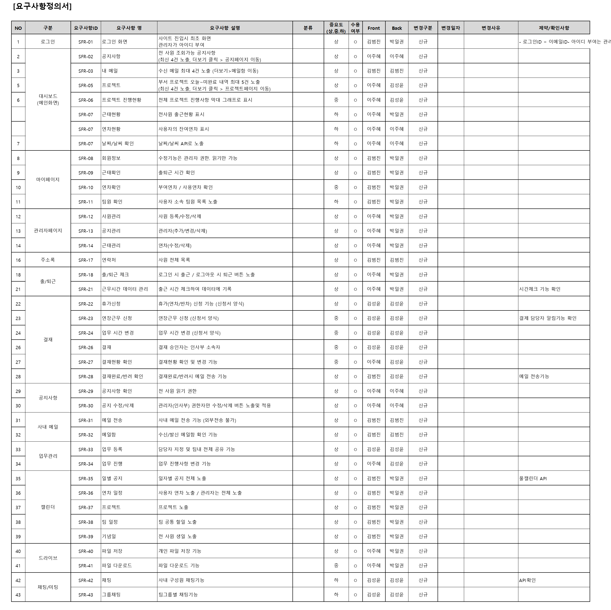
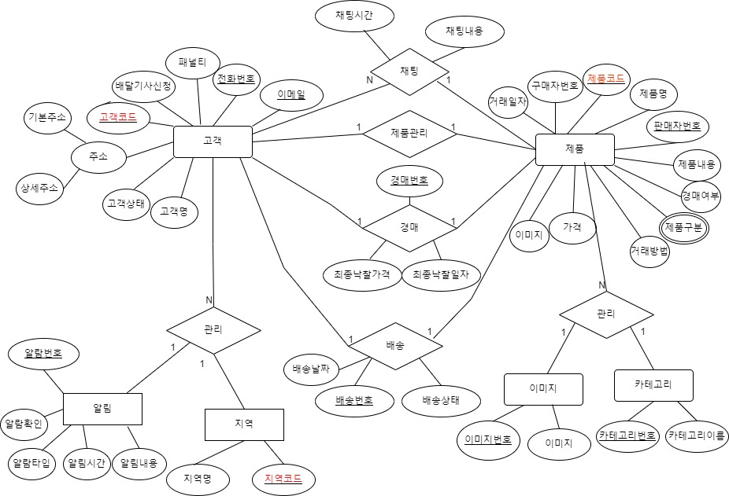

# [ 1조] 뜨끈한 우동(mvc2 프로젝트)

# **프로젝트 소개**

---

[프로젝트 후기 ](https://www.notion.so/65df094298784a7293484cf372efdd27?pvs=21)

[프로젝트 후기 (이준영)](https://www.notion.so/99ca5487376b4c40a6a7e9125f4109f1?pvs=21)

### **경매 시스템을 결합한 중고 거래 플랫폼 개발**

## 프로젝트 개요

**경매를 결합한 중고 거래의 경험:** 기존 중고 거래 플랫폼에 경매 시스템을 통합하여, 사용자들이 중고 상품과 새 상품의 가격을 비교하고 구매 할 수 있습니다.

**배달 아르바이트 시스템 도입:** 직접 대면하지 않고 중고 거래를 할 수 있는 경험을 제공합니다.

**개인 정보 보호 강화:** QR 코드를 활용한 결제 시스템으로 개인정보를 보호하며, 사용자 간의 신뢰를 구축합니다.

### **1. 프로젝트 목적**

---

- **중고 거래 및 경매 시스템 구축:** 사용자들이 상품을 거래하고, 경매에 참여할 수 있는 안전한 플랫폼 제공.
- **지역 사회 소통 촉진:** 사용자들 간의 소통을 가능하게 하여 지역 사회의 연결을 강화.
- **신뢰성 있는 거래 경험 제공:** 원활하고 편리한 거래를 통해 사용자 경험 향상.

---

### **2. 프로젝트 범위**

- **중고 거래 및 경매 시스템:** 사용자들은 상품을 쉽게 등록하고 경매에 참여할 수 있습니다.
- **안전한 거래 환경:** QR 코드와 같은 기술을 통해 구매자와 판매자의 신뢰성 있는 거래를 지원합니다.
- **지역 커뮤니티와 연계된 배송 서비스:** 배송 서비스를 제공하여 거래의 편의성을 높입니다.

---

### **3. 프로젝트의 중요성**

- **시장 활성화:** 사용자들에게 제공되는 안전하고 편리한 거래 플랫폼으로 중고 거래 및 경매 시장을 활성화합니다.
- **소통과 교류의 장:** 지역 커뮤니티 내에서의 거래를 통해 사용자들 간의 소통과 교류를 촉진합니다.
- **경제적 이익 증대:** 배송 서비스를 통한 효율적인 거래로 지역 경제의 활성화에 기여합니다.

---

### **4. 기대 효과**

- **신뢰할 수 있는 거래 플랫폼:** 사용자들이 안전하게 상품을 거래할 수 있는 환경을 제공합니다.
- **지역 경제의 성장:** 거래와 교류를 통해 지역 경제에 새로운 활력을 불어넣습니다.
- **상호작용 증진:** 다양한 기능을 통해 사용자들은 지역 내에서 소통하고 다양한 상호작용을 경험할 수 있습니다.

### 팀원 구성

---

## 프로젝트 기술 스택

### 핵심 비지니스 기능 목표 + api

⭐ 중고 거래 플랫폼

⭐ 경매 시스템 도입 

⭐ 배달 알바 → GPS 네비게이션 활용

⭐ 최저가 API 활용하여 새상품 가격 비교

⭐ 구글 OR 네이버 OR 카카오 활용 회원가입 로그인

⭐ GPS 활용 해당 지역 안전문자 알림

⭐ 개인정보 보호를 위한 QR 결제 시스템

### **Frontend:**

- **HTML5, CSS3:** 웹 페이지 구조 및 스타일링
- **JavaScript (ES6+):** 클라이언트 측 프로그래밍
- **Ajax:** 비동기 통신 구현

### **Backend:**

- **Node.js:** 서버 사이드 개발
- **Mysql:**  데이터베이스 관리

### **협업 및 버전 관리:**

- **Git:** 협업 및 소스 코드 버전 관리
- **GitHub, GitLab:** Git 저장소 및 협업 플랫폼

### **API 및 기타 기 추천 :**

- **지도 및 위치 기반 서비스**:
    - Kakao Maps API: 사용자의 위치 표시 및 경매 상품 위치 정보 제공.
        - [https://apis.map.kakao.com/web/sample/coord2addr/](https://apis.map.kakao.com/web/sample/coord2addr/)
    - kakaoT 퀵 • 도보 배송 API : 배송 알바 경로 계획과 지역 기반 서비스 제공.
        - [https://logistics-developers.kakaomobility.com/document/post-orders](https://logistics-developers.kakaomobility.com/document/post-orders)
- **결제 시스템**:
    - PayPal API, Stripe API: 국제 결제 지원.
        - [https://developer.paypal.com/docs/checkout/](https://developer.paypal.com/docs/checkout/)
        - [https://docs.stripe.com/api](https://docs.stripe.com/api)
    - Iamport: 국내 결제 시스템 연동을 위한 API.
- **푸시 알림 서비스**:
    - Firebase Cloud Messaging(FCM): 사용자에게 실시간 알림 제공.
        - [Firebase Documentation](https://firebase.google.com/?_gl=1*18jinxl*_up*MQ..*_ga*OTY0ODcyNjM1LjE3MDg2MjA4MDY.*_ga_CW55HF8NVT*MTcwODYyMDgwNi4xLjAuMTcwODYyMDgxNy4wLjAuMA..&hl=ko)
- **실시간 통신**:
    - Socket.IO: 웹소켓 기반의 실시간 채팅 및 경매 입찰 상태 업데이트.
        - [Socket.IO Documentation](https://socket.io/docs/v4/)
    - WebSockets API: 브라우저와 서버 간의 실시간 양방향 통신 구현.
        - [https://developer.mozilla.org/en-US/docs/Web/API/WebSockets_API](https://developer.mozilla.org/en-US/docs/Web/API/WebSockets_API)
- **소셜 로그인**:
    - Google, Facebook, Naver, Kakao Login API: 다양한 플랫폼을 통한 사용자 인증 간소화.
        - [https://cloud.google.com/security/products/identity-platform](https://cloud.google.com/security/products/identity-platform)
        - [https://developers.naver.com/products/login/api/api.md](https://developers.naver.com/products/login/api/api.md)
        - [https://developers.kakao.com/docs/latest/ko/kakaologin/rest-api](https://developers.kakao.com/docs/latest/ko/kakaologin/rest-api)
- **상품 가격 비교**:
    - Naver Shopping API: 상품 검색 및 가격 비교를 통한 최적의 거래 옵션 제공.
        - [https://developers.naver.com/docs/serviceapi/search/shopping/shopping.md](https://developers.naver.com/docs/serviceapi/search/shopping/shopping.md)
- **SMS 및 안전문자 알림**:
    - Twilio API, Nexmo API: SMS 기반 인증, 알림, 안전문자 발송 기능.
        - [https://www.twilio.com/docs](https://www.twilio.com/docs)
        - [https://developer.vonage.com/en/home](https://developer.vonage.com/en/home)
- **QR 코드 생성 및 스캔**:
    - Google Charts API: QR 코드 생성을 통한 안전한 결제 방식 지원.
        - [https://developers.google.com/chart?hl=ko](https://developers.google.com/chart?hl=ko)

## github 링크

---

[https://github.com/ChoiSeoungH/HotUdon](https://github.com/ChoiSeoungH/HotUdon)

## 프로젝트 요구사항

### 요구사항정의서

- 그림 업로드
    
    
    

### 프로그램목록/Class

- 그림 업로드
    
    
    

### database ERD 다이어그램

- 그림 업로드
    
    
    

### 정보구조도

- 그림 업로드
    
    
    

### 테이블정의서

- 그림 업로드
    
    
    

---

## 일정

[프로젝트 1 일정 (1)](README.img/%E1%84%91%E1%85%B3%E1%84%85%E1%85%A9%E1%84%8C%E1%85%A6%E1%86%A8%E1%84%90%E1%85%B3%201%20%E1%84%8B%E1%85%B5%E1%86%AF%E1%84%8C%E1%85%A5%E1%86%BC%20(1)%20f6860134d70b4a02a994806a7691b5bc.csv)

//미완성

[요구사항 정의서.xlsx](README.img/%25EC%259A%2594%25EA%25B5%25AC%25EC%2582%25AC%25ED%2595%25AD_%25EC%25A0%2595%25EC%259D%2598%25EC%2584%259C.xlsx)

[1조_테이블정의서.xls](README.img/1%25EC%25A1%25B0_%25ED%2585%258C%25EC%259D%25B4%25EB%25B8%2594%25EC%25A0%2595%25EC%259D%2598%25EC%2584%259C.xls)

[1조프로젝트.drawio](README.img/1%25EC%25A1%25B0%25ED%2594%2584%25EB%25A1%259C%25EC%25A0%259D%25ED%258A%25B8.drawio)

[1조_테이블정의서_2.xls](README.img/1%25EC%25A1%25B0_%25ED%2585%258C%25EC%259D%25B4%25EB%25B8%2594%25EC%25A0%2595%25EC%259D%2598%25EC%2584%259C_2.xls)

[발표.pptx](README.img/%25EB%25B0%259C%25ED%2591%259C.pptx)